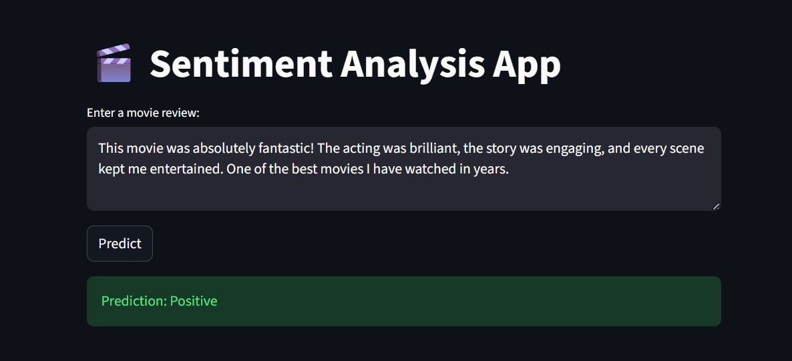
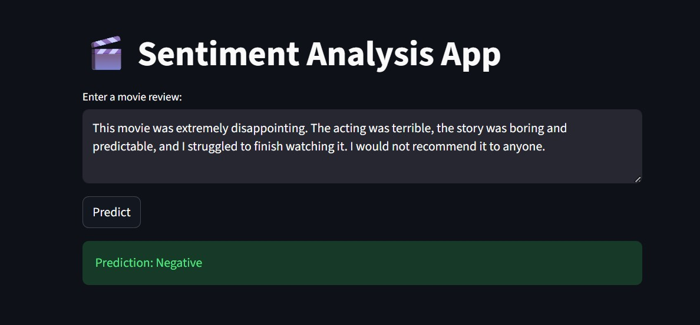

# 🎬 Sentiment Analysis using LSTM

An end-to-end Natural Language Processing (NLP) project that classifies IMDB movie reviews as **Positive** or **Negative** using a custom **LSTM-based deep learning model built with PyTorch**.

The project includes data preprocessing, vocabulary construction, text encoding, sequence padding, word embeddings, LSTM-based text classification, model training and evaluation, model serialization, and an interactive **Streamlit web application** for real-time sentiment prediction.

---

## Problem Statement

With the increasing amount of textual content available online, manually analyzing opinions and feedback is time-consuming and difficult to scale.

Movie reviews contain valuable information about audience opinions, but manually determining whether a review expresses a positive or negative sentiment can be inefficient.

This project aims to develop an automated **Sentiment Analysis system** that processes movie-review text and classifies it into one of two sentiment categories:

- **Positive**
- **Negative**

The system uses Natural Language Processing techniques to transform unstructured text into numerical representations and a deep learning model to learn sentiment patterns from movie reviews.

---

## Objectives

The main objectives of this project are:

- Build an end-to-end NLP pipeline for sentiment classification.
- Preprocess and clean unstructured movie-review text.
- Convert textual data into numerical sequences suitable for deep learning.
- Build a custom vocabulary from the training dataset.
- Handle unknown words using an `<UNK>` token.
- Handle variable-length reviews using padding and truncation.
- Learn word representations using trainable word embeddings.
- Implement an LSTM-based binary classification model using PyTorch.
- Train and evaluate the model on unseen movie reviews.
- Save the trained model and vocabulary for future inference.
- Develop an interactive Streamlit application for real-time sentiment prediction.

---

## Dataset

The project uses the **IMDB Movie Review Dataset**, containing **50,000 movie reviews** labeled as either positive or negative.

### Dataset Statistics

| Property | Value |
|---|---:|
| Total Reviews | 50,000 |
| Positive Reviews | 25,000 |
| Negative Reviews | 25,000 |
| Classes | 2 |
| Training Samples | 40,000 |
| Testing Samples | 10,000 |

The dataset is balanced, with an equal number of positive and negative reviews.

### Dataset Columns

| Column | Description |
|---|---|
| `review` | Movie review text |
| `sentiment` | Sentiment label (`positive` / `negative`) |

### Dataset Source

The dataset is available on Kaggle:

**https://www.kaggle.com/datasets/lakshmi25npathi/imdb-dataset-of-50k-movie-reviews**

The dataset is **not included in this repository**.

To reproduce the training process, download the dataset and place it at:

```text
data/IMDB Dataset.csv
```

---

## Exploratory Data Analysis

The dataset was loaded and inspected using Pandas.

The following checks were performed:

- Dataset shape
- Column information
- Sentiment distribution
- Missing-value detection
- Sample review inspection

The dataset contains:

- **50,000 reviews**
- **2 columns**
- **0 missing values**

The sentiment distribution is:

```text
Positive → 25,000
Negative → 25,000
```

The balanced distribution makes the dataset suitable for binary sentiment classification.

---

## Project Approach

The complete system follows the pipeline below:

```text
                    IMDB Dataset
                         │
                         ▼
                  Data Exploration
                         │
                         ▼
                  Train/Test Split
                         │
                         ▼
                  Text Preprocessing
                         │
                         ▼
                     Tokenization
                         │
                         ▼
                Vocabulary Creation
                         │
                         ▼
                   Integer Encoding
                         │
                         ▼
                Padding / Truncation
                         │
                         ▼
                   Word Embedding
                         │
                         ▼
                       LSTM
                         │
                         ▼
                 Fully Connected Layer
                         │
                         ▼
                  Sentiment Prediction
                         │
                ┌────────┴────────┐
                ▼                 ▼
             Positive          Negative
```

---

# Text Preprocessing

Raw movie reviews cannot be directly passed into the neural network. Therefore, a preprocessing pipeline was implemented.

### 1. Lowercasing

All reviews are converted to lowercase.

Example:

```text
"This Movie Was Amazing"
```

becomes:

```text
"this movie was amazing"
```

This prevents uppercase and lowercase versions of the same word from being treated as different vocabulary entries.

### 2. HTML Tag Removal

The IMDB dataset contains HTML tags such as:

```html
<br /><br />
```

These tags are removed using regular expressions.

### 3. Removing Punctuation and Numbers

Punctuation, numbers, and other non-alphabetic characters are removed to simplify the text representation.

### 4. Whitespace Normalization

Multiple spaces are replaced with a single space and leading/trailing whitespace is removed.

---

# Tokenization

After cleaning the text, each review is split into individual words.

For example:

```text
"this movie is great"
```

becomes:

```python
["this", "movie", "is", "great"]
```

The project uses simple whitespace-based tokenization.

---

# Vocabulary Construction

A custom vocabulary was created from the training reviews.

The **10,000 most frequent words** were selected.

Two special tokens were added:

| Token | Index | Purpose |
|---|---:|---|
| `<PAD>` | 0 | Used for padding sequences |
| `<UNK>` | 1 | Used for unknown words |

Therefore, the final vocabulary contains:

```text
10,000 words + 2 special tokens = 10,002 tokens
```

---

# Integer Encoding

The vocabulary maps each word to a numerical index.

For example:

```text
"this movie is great"
```

could be converted into:

```text
[10, 234, 8, 567]
```

Words that are not present in the vocabulary are mapped to:

```text
<UNK>
```

This converts natural language into numerical data that can be processed by PyTorch.

---

# Sequence Padding and Truncation

Movie reviews have different lengths.

To process them in batches, all reviews are converted to a fixed sequence length of:

```text
MAX_LEN = 200
```

### Short Reviews

Short reviews are padded with:

```text
<PAD> = 0
```

### Long Reviews

Reviews longer than 200 tokens are truncated to 200 tokens.

Therefore, every input to the model has the same shape:

```text
200 tokens
```

---

# Model Architecture

The sentiment classifier is implemented using **PyTorch**.

The architecture consists of:

```text
Input Token IDs
       │
       ▼
Embedding Layer
       │
       ▼
LSTM Layer
       │
       ▼
Final Hidden State
       │
       ▼
Fully Connected Layer
       │
       ▼
Output Logit
       │
       ▼
Positive / Negative
```

### Model Configuration

| Component | Configuration |
|---|---|
| Vocabulary Size | 10,002 |
| Embedding Dimension | 128 |
| LSTM Hidden Dimension | 128 |
| Sequence Length | 200 |
| Output Dimension | 1 |
| Batch Size | 32 |
| Epochs | 5 |
| Optimizer | Adam |
| Learning Rate | 0.001 |
| Loss Function | BCEWithLogitsLoss |

---

# Word Embedding Layer

The first component of the model is a trainable embedding layer:

```python
nn.Embedding(vocab_size, embed_dim)
```

Each word is converted into a **128-dimensional vector representation**.

Instead of treating word IDs as meaningful numerical values, the embedding layer learns useful representations of words during training.

The embedding output is then passed into the LSTM.

---

# LSTM Layer

The core of the model is a **Long Short-Term Memory (LSTM)** network.

LSTM networks are designed to process sequential data and maintain information from earlier parts of a sequence.

This is particularly useful for natural language because word order and context can influence meaning.

For example:

```text
"The movie was not good."
```

The word `not` changes the meaning of `good`.

The LSTM processes the sequence and produces a final hidden representation containing information learned from the review.

---

# Fully Connected Layer

The final hidden state of the LSTM is passed through a fully connected layer:

```python
nn.Linear(hidden_dim, 1)
```

This produces a single output value called a **logit**.

For training, the model uses:

```python
BCEWithLogitsLoss()
```

which is appropriate for binary classification.

---

# ⚙️ Model Training

The dataset was divided into:

```text
80% → Training
20% → Testing
```

Resulting in:

```text
Training → 40,000 reviews
Testing  → 10,000 reviews
```

The model was trained for **5 epochs** using:

- Batch size: `32`
- Optimizer: `Adam`
- Learning rate: `0.001`
- Loss function: `BCEWithLogitsLoss`

---

# 📉 Training Results

The average training loss decreased consistently over the five epochs.

| Epoch | Training Loss |
|---:|---:|
| 1 | 0.3657 |
| 2 | 0.2793 |
| 3 | 0.2342 |
| 4 | 0.1989 |
| 5 | 0.1758 |

The decrease in loss indicates that the model was learning patterns from the training data.

---

# Model Performance

The trained model achieved:

## **86.58% Test Accuracy**

on the 10,000 unseen test reviews.

### Performance Summary

| Metric | Result |
|---|---:|
| Dataset Size | 50,000 |
| Training Samples | 40,000 |
| Testing Samples | 10,000 |
| Vocabulary Size | 10,002 |
| Embedding Dimension | 128 |
| LSTM Hidden Dimension | 128 |
| Sequence Length | 200 |
| Epochs | 5 |
| Test Accuracy | **86.58%** |

The model correctly classified approximately **8,658 out of 10,000** test reviews.

---

# Model Serialization

After training, the model parameters were saved using PyTorch.

### Trained Model

```text
sentiment_model.pth
```

This file contains the trained LSTM model weights.

### Vocabulary

```text
word2idx.pt
```

This file contains the word-to-index vocabulary used during training.

These files allow the Streamlit application to perform inference without retraining the model.

---

# Streamlit Application

The trained model was integrated into an interactive **Streamlit web application**.

The application allows users to enter a movie review and receive an immediate sentiment prediction.

### Application Flow

```text
User Input
    │
    ▼
Text Cleaning
    │
    ▼
Tokenization
    │
    ▼
Vocabulary Encoding
    │
    ▼
Padding / Truncation
    │
    ▼
LSTM Model
    │
    ▼
Prediction
    │
    ▼
Positive / Negative
```

---

# Application Screenshots

## Final Streamlit Interface



## Sentiment Prediction



---

# Example Predictions

## Example 1 — Positive Review

### Input

```text
This movie was absolutely fantastic! The acting was brilliant,
the story was engaging, and every scene kept me entertained.
One of the best movies I have watched in years.
```

### Prediction

```text
Positive
```

---

## Example 2 — Negative Review

### Input

```text
This movie was extremely disappointing. The acting was terrible,
the story was boring and predictable, and I struggled to finish
watching it.
```

### Prediction

```text
Negative
```

---

## Example 3 — Mixed Review

### Input

```text
The movie had beautiful visuals and some excellent performances,
but the story was slow and confusing. I enjoyed parts of it,
but overall I don't think it was worth watching.
```

This type of review is more challenging because it contains both positive and negative sentiment.

---

# 📁 Project Structure

```text
sentiment-analysis-lstm/
│
├── data/
│   └── README.md
│
├── notebooks/
│   └── sentiment_analysis.ipynb
│
├── screenshots/
│   ├── 1.jpg
│   └── 2.jpg
│
├── src/
│   ├── __init__.py
│   ├── dataset.py
|   ├── file.py
│   └── model.py
│
├── app.py
├── requirements.txt
├── sentiment_model.pth
├── word2idx.pt
├── README.md
└── .gitignore
```

---

# 📂 Project Files

| File / Directory | Description |
|---|---|
| `data/` | Dataset documentation and instructions |
| `notebooks/sentiment_analysis.ipynb` | Model development, training, evaluation, and experimentation |
| `screenshots/` | Screenshots of the Streamlit application |
| `src/dataset.py` | Custom PyTorch Dataset implementation |
| `src/model.py` | LSTM sentiment classification architecture |
| `app.py` | Streamlit application for real-time predictions |
| `requirements.txt` | Required Python dependencies |
| `sentiment_model.pth` | Saved trained model weights |
| `word2idx.pt` | Saved vocabulary mapping |
| `README.md` | Project documentation |
| `.gitignore` | Files excluded from version control |

---

# 🛠️ Technologies Used

### Programming Language

- Python

### Deep Learning

- PyTorch
- LSTM
- Word Embeddings

### Natural Language Processing

- Text preprocessing
- Tokenization
- Vocabulary construction
- Integer encoding
- Sequence padding
- Binary sentiment classification

### Data Processing

- Pandas
- NumPy

### Machine Learning

- Scikit-learn

### Application Development

- Streamlit

### Development Environment

- Jupyter Notebook
- VS Code

---

# 🚀 Installation and Setup

## 1. Clone the Repository

```bash
git clone https://github.com/YOUR-USERNAME/sentiment-analysis-lstm.git
```

Navigate into the project:

```bash
cd sentiment-analysis-lstm
```

---

## 2. Create a Virtual Environment

### Windows

```bash
python -m venv sentiment-env
```

Activate the environment:

```bash
sentiment-env\Scripts\activate
```

### macOS / Linux

```bash
python3 -m venv sentiment-env
```

Activate:

```bash
source sentiment-env/bin/activate
```

---

## 3. Install Dependencies

```bash
pip install -r requirements.txt
```

---

# ▶️ Running the Streamlit Application

Once the dependencies are installed, run:

```bash
streamlit run app.py
```

Streamlit will start a local development server.

Open the URL shown in the terminal, typically:

```text
http://localhost:8501
```

The sentiment analysis interface will open in your browser.

---

# 🔬 Reproducing the Training Process

The trained model is already included in the repository, so **training is not required to use the Streamlit application**.

If you want to reproduce the training process:

### Step 1 — Download the Dataset

Download the IMDB dataset from Kaggle:

https://www.kaggle.com/datasets/lakshmi25npathi/imdb-dataset-of-50k-movie-reviews

### Step 2 — Add the Dataset

Place the downloaded CSV file at:

```text
data/IMDB Dataset.csv
```

### Step 3 — Open the Notebook

Open:

```text
notebooks/sentiment_analysis.ipynb
```

### Step 4 — Run the Notebook

Run the notebook cells sequentially.

The notebook performs:

```text
Load Dataset
     ↓
Explore Dataset
     ↓
Encode Labels
     ↓
Train/Test Split
     ↓
Clean Text
     ↓
Tokenize
     ↓
Build Vocabulary
     ↓
Encode Text
     ↓
Pad Sequences
     ↓
Create PyTorch Dataset
     ↓
Create DataLoader
     ↓
Build LSTM Model
     ↓
Train Model
     ↓
Evaluate Model
     ↓
Save Model
```

---

# ⚠️ Limitations

Despite achieving 86.58% test accuracy, the model has several limitations.

### Fixed Sequence Length

The model only processes the first 200 tokens of each review. Information beyond this limit is discarded.

### Limited Vocabulary

The vocabulary contains the 10,000 most frequent words. Words outside the vocabulary are represented using `<UNK>`.

### Simple Tokenization

The project uses whitespace-based tokenization rather than advanced NLP tokenizers.

### Binary Classification

The model supports only:

```text
Positive
Negative
```

It does not currently classify neutral sentiment.

### Sarcasm and Complex Language

The model may struggle with:

- Sarcasm
- Irony
- Complex negation
- Subtle opinions
- Reviews containing strongly mixed sentiment

### Model Architecture

The model uses a relatively simple LSTM architecture and does not use pretrained language models.

---

# 🔮 Future Improvements

Potential improvements include:

- Add a validation dataset during training.
- Add precision, recall, and F1-score.
- Generate a confusion matrix.
- Add training and validation accuracy/loss plots.
- Implement Bidirectional LSTM (BiLSTM).
- Add dropout for improved regularization.
- Experiment with GRU architectures.
- Improve tokenization.
- Use pretrained word embeddings.
- Add sentiment confidence scores to the Streamlit interface.
- Support neutral sentiment.
- Compare the LSTM model against Transformer-based models such as BERT.
- Deploy the Streamlit application publicly.
- Add automated testing.
- Create a dedicated training script.
- Improve model performance through hyperparameter tuning.

---

# 📚 Key Learning Outcomes

Through this project, I gained practical experience in:

- Natural Language Processing
- Text classification
- Data preprocessing
- Vocabulary construction
- Tokenization
- Sequence encoding
- Padding and truncation
- Word embeddings
- Recurrent Neural Networks
- LSTM architectures
- PyTorch Dataset and DataLoader
- Deep learning model training
- Binary classification
- Model evaluation
- Model serialization
- Model inference
- Streamlit application development

---

# 💡 Key Project Highlights

- Processed **50,000 IMDB movie reviews**.
- Built a complete NLP preprocessing pipeline.
- Created a **10,002-token vocabulary**.
- Implemented **128-dimensional trainable word embeddings**.
- Developed an LSTM-based sentiment classifier using PyTorch.
- Trained the model for **5 epochs**.
- Achieved **86.58% test accuracy**.
- Evaluated the model on **10,000 unseen reviews**.
- Saved the trained model for reusable inference.
- Built an interactive **Streamlit web application**.
- Enabled real-time **Positive/Negative sentiment classification**.

---

# 👩‍💻 Author

## Chhandavi Gowardhan

This project was developed to demonstrate practical experience in:

**Natural Language Processing | Deep Learning | PyTorch | LSTM | Text Classification | Streamlit | Machine Learning**

---
